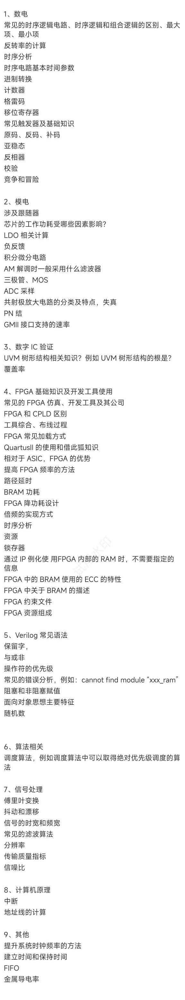
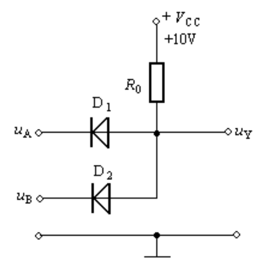

<!-- =====================================================================
* Copyright (c) 2023, MongooseOrion.
* All rights reserved.
*
* The following code snippet may contain portions that are derived from
* OPEN-SOURCE communities, and these portions will be licensed with: 
*
* <NULL>
*
* If there is no OPEN-SOURCE licenses are listed, it indicates none of
* content in this Code document is sourced from OPEN-SOURCE communities. 
*
* In this case, the document is protected by copyright, and any use of
* all or part of its content by individuals, organizations, or companies
* without authorization is prohibited, unless the project repository
* associated with this document has added relevant OPEN-SOURCE licenses
* by github.com/MongooseOrion. 
*
* Please make sure using the content of this document in accordance with 
* the respective OPEN-SOURCE licenses. 
* 
* THIS CODE IS PROVIDED BY https://github.com/MongooseOrion. 
* FILE ENCODER TYPE: UTF-8
* ========================================================================
-->
# 华为校招的知识点

---

  1. 什么是时序逻辑电路？它与组合逻辑电路的主要区别是什么？

      时序逻辑电路的信号由时钟边沿控制，在时钟边沿未来临时数据保持稳定，只在时钟边沿产生数据的变化。根据主时钟的不同，可分为同步时序电路和异步时序电路，它们各自域下的信号保持同步变化，但是从域间视角看，信号在各自的时钟边沿下变化，因此被称作异步。时序逻辑电路与组合逻辑电路最大的不同就在于时序电路需要时钟控制，组合逻辑电路的信号产生的变化会立即反映到后续信号中，这可能会产生竞争-冒险现象，信号敏感的位置不应使用组合逻辑控制。

  2. 计算反转系数的公式是什么？

      反转系数（toggle rate）指的是信号在单位时间内的翻转次数，包括从 0 到 1 和 从 1 到 0 两个部分。

  3. 请解释时序分析的基本概念。

      时序分析包括静态时序分析和动态时序分析。静态时序分析用于分析电路中可能存在的时序问题，会遍历电路存在的所有时序路径，并检查传播延时，检查建立时间和保持时间是否存在违例的情况。动态时序分析用于检查电路的逻辑功能，理论上应该需要给所有的信号进行激励，以便查看其逻辑功能是否正确（称为测试向量），但是随着电路规模变大，事无巨细检查每一条路径上的逻辑几乎是不可能的事情。因此，一般需要结合 STA 和 DTA 对电路进行测试。STA 的优势是运行速度快，且占用内存小，可以检查所有路径下是否有时序违例的情况，但是无法检查逻辑功能的正确性；DTA 的优势是可以检查逻辑功能是否准确，但很难产生覆盖所有情况的测试向量。

  4. 你能列出几种常见的模数转换器（ADC）的分类及其特点吗？

      常用的 ADC 包括直接 ADC 和间接 ADC，直接 ADC 会直接将模拟量转换为数字量，例如并行比较型和逐次比较型；间接 ADC 会将模拟量先转换为时间或者频率等中间量，再转换为数字量，例如双积分型。并行比较型拥有最快的速度，但效果最差；双积分型效果最好，但是速度最慢。

  5. 什么是LDO，如何进行相关计算？

      LDO 为低压差稳压器，它用于将较大的输入电压转换为稳定的电压，其输出电压公式为：

      $$V_{\text{out}} = (1+\frac{R_2}{R_1})V_{\text{ref}}$$

      LDO 本质上是将多余的功率转化为热量来调节电压，从而使该集成电路非常适合低功耗或 $V_{\text{in}}$ 与 $V_{\text{out}}$ 差值较小的应用。LDO的关键参数包括压差、电源抑制比（PSRR）、静态电流和负载调节。

  6. 计数器在数字电路中的作用是什么？你能列举几种常见的计数器类型吗？

      计数器用于对某一信号或几个信号的组合变化情况进行计数，当达到预设的计数条件时，进行计数，这等效为使用使能端来控制计数器。常见的计数器类型还包括加法计数器（只计数上升沿或下降沿）、减法计数器（只计数下降）、环形计数器和扭环形计数器，它们具有特定的应用场景。加减法计数器区分置数方式的同步或异步、清零方式的同步或异步；环形计数器 n 个 D 触发器首尾相连，构成 n bit 计数，无效状态有 $2^n-n$ 个；扭环形计数器 n 个 JK 触发器首尾交叉相连，构成 2n bit 计数，无效状态有 $2^n - 2n$ 个。

  7. 什么是CMT？它在FPGA中的作用是什么？

      CMT 指时钟管理单元，不同的 FPGA 器件中可能包含 MMCM、PLL 和 DLL 等不同的器件。时钟管理单元的作用是管理和生成不同频率、相位和占空比的时钟，同时可实现时钟缓冲，以满足电路的同步和异步需求，这对于复杂 FPGA 设计中的时钟树优化非常重要。

  8. 什么是三极管的放大作用，为什么三极管能起到放大作用？

      三级管的放大作用是指，集电极电流受基极电流的控制，并且基极电流很小的变化，会引起集电极电流很大的变化，且变化满足一定的比例关系：集电极电流的变化量是基极电流变化量的 $\beta$ 倍，即电流变化被放大了 $\beta$ 倍，所以我们把 $\beta$ 叫做三极管的放大倍数。放大原理涉及到三极管工作在 “放大区”，即基极-发射极电压在 0.7V 左右时，集电极电流和基极电流之间的关系符合放大特性。

  9. 在 Verilog 中，阻塞赋值和非阻塞赋值的区别是什么？应该在什么情况下使用？

      在 verilog 代码被综合时，同一个 always 块中的信号，如果采用阻塞赋值，说明语句中存在着先后顺序，信号是 “阻塞” 的；如果采用非阻塞赋值，则所有信号会同步被赋值。阻塞赋值用于组合逻辑中，非阻塞赋值用于时序逻辑中，在编写验证代码时，一般采用阻塞赋值，因为这样会反映出信号随时间的变化情况。

---

## 滤波器与跟随器

  * 滤波器：滤波器用于选择或抑制特定频率范围内的信号。常见的滤波器类型有：
  * 低通滤波器：允许低频信号通过，阻止高频信号。
  * 高通滤波器：允许高频信号通过，阻止低频信号。
  * 带通滤波器：允许特定频段内的信号通过，阻止频段外的信号。
  * 带阻滤波器：阻止特定频段内的信号，允许频段外的信号通过。
  * 跟随器（电压跟随器）：这是一个运算放大器电路，输出电压跟随输入电压，用于信号缓冲，提供高输入阻抗和低输出阻抗，从而避免信号源受到负载影响。

## 芯片功耗影响因素

芯片的功耗由以下因素决定：

  * 工作电压：更高的电压通常会导致更高的功耗。
  * 工作频率：频率越高，功耗越大，因为每个时钟周期都有功耗发生。
  * 负载电流：负载电流增加会导致功耗增加。
  * 环境温度：高温会增加漏电流，从而增加功耗。
  * 工艺制程：先进的工艺制程可以降低功耗。
  * 动态功耗与静态功耗：动态功耗由开关活动产生，静态功耗则与漏电流相关。

## LDO（低压差线性稳压器）

LDO 为低压差稳压器，它用于将较大的输入电压转换为稳定的电压，其输出电压公式为：

$$V_{\text{out}} = (1+\frac{R_2}{R_1})V_{\text{ref}}$$

LDO 本质上是将多余的功率转化为热量来调节电压，从而使该集成电路非常适合低功耗或 $V_{\text{in}}$ 与 $V_{\text{out}}$ 差值较小的应用。LDO的关键参数包括压差、电源抑制比（PSRR）、静态电流和负载调节。

## 负反馈

负反馈是一种将输出的一部分信号反馈到输入端的技术，以稳定系统、减少失真并增加带宽。在放大器设计中，负反馈可以提高增益稳定性和减少噪声。

## 积分和微分电路

  * 积分电路：积分运算可以将输入电压的变化累加起来，输出一个随时间累积的电压信号。典型应用包括模拟滤波器和 PID 控制器中的积分部分。

  * 微分电路：微分运算可以将输入信号的变化率转化为输出信号，主要用于检测信号的快速变化，应用于边缘检测和 PID 控制器中的微分部分。

积分电路可把矩形波转换成三角波；微分电路可把矩形波转换成尖脉冲波，可以把尖峰波转变为矩形波。

## AM 解调滤波器

在 AM（调幅）解调过程中，通常使用带通滤波器来选择所需的频率范围，滤除载波和其他干扰信号，从而提取有用的调制信息。

## 三极管与 MOS 管

三极管（BJT）：三极管有三种工作区域：截止区（关断）、放大区和饱和区。它们在放大和开关电路中被广泛使用。

MOS管（MOSFET）：MOSFET 是常用的场效应管，具有高输入阻抗和低导通电阻。N 沟道和 P 沟道 MOSFET 被广泛用于开关电源、放大器和数字电路中。

### 三极管的放大作用

三级管的放大作用是指，集电极电流受基极电流的控制，并且基极电流很小的变化，会引起集电极电流很大的变化，且变化满足一定的比例关系：集电极电流的变化量是基极电流变化量的 $\beta$ 倍，即电流变化被放大了 $\beta$ 倍，所以我们把 $\beta$ 叫做三极管的放大倍数。放大原理涉及到三极管工作在 “放大区”，即基极-发射极电压在 0.7V 左右时，集电极电流和基极电流之间的关系符合放大特性。

## ADC 采样

**模数转换器（ADC）**用于将模拟信号转换为数字信号。ADC 的关键参数包括分辨率（通常以位数表示，如 10位、12 位）、采样率（每秒采样的次数）、信噪比（SNR）和量化误差。采样率决定了ADC能捕捉的最高频率信号，分辨率决定了信号的精细度。

常用的 ADC 包括直接 ADC 和间接 ADC，直接 ADC 会直接将模拟量转换为数字量，例如并行比较型和逐次比较型；间接 ADC 会将模拟量先转换为时间或者频率等中间量，再转换为数字量，例如双积分型。并行比较型拥有最快的速度，但效果最差；双积分型效果最好，但是速度最慢。

## 共射极放大电路

共射极放大器是三极管的基本放大电路结构，具有高电压增益。其特点包括：
    
  * 增益：输入小信号被放大，输出电压增大。
  * 频率响应：频率越高，增益可能会下降，需要考虑电容效应。
  * 失真：大信号可能导致失真，尤其是在放大器的非线性区域工作时。

## PN 结

PN 结是半导体材料中 P 型材料和 N 型材料的交界面。在正向偏置下，PN 结允许电流通过；在反向偏置下，阻止电流通过，直到击穿电压达到。PN 结是二极管、晶体管的核心结构。

### 二极管等效与门电路

  1. $U_A=U_B=0\text{v}$ 时，D1，D2 正偏，两个二极管均会导通，此时 $U_Y$ 点电压即为二极管导通电压，也就是 D1，D2 导通电压 0.7v。
  2. 当 $U_A,U_B$ 一高一低时，不妨假设 $U_A=3\text{v}, U_B=0\text{v}$ ，先从 D2 开始分析，D2 会导通，导通后 D2 压降将会被限制在 0.7v，那么 D1 由于右边是 0.7v 左边是 3v 所以会反偏截止，因此最后 $U_Y$ 为 0.7v。
  3. $U_A,U_B=3\text{v}$ ，这个情况很好理解，D1，D2 都会反偏， $U_Y$ 被限定在 3.7v。

### 二极管等效或门电路

  1. 当 $U_A=U_B=0\text{v}$ 时，D1，D2 都截至，那么 Y 点为 0v.
  2. 当 $U_A=3\text{v}，U_b=0\text{v}$ 时，此时 D1 导通， $U_Y=3-0.7=2.3\text{v}$ ，D2 则截止。
  3. 当 $U_A=U_B=3\text{v}$ 时，此时 D1，D2 都导通， $U_Y=3-0.7=2.3\text{v}$ 。

## GMII接口支持的速率

**GMII（Gigabit Media Independent Interface）**是千兆以太网接口标准，支持 1 Gbps的传输速率。它用于 MAC 层和 PHY 层之间的数据传输，适用于千兆以太网通信。

---

